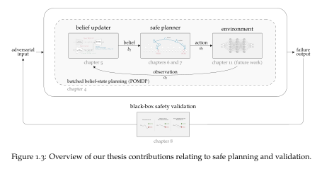

# Safe planning under uncertainty using surrogate models
Robert J. Moss

> Doctor of Philosophy (Ph.D.) in Computer Science
>
> _Stanford University_

See [moss-phd-thesis.pdf](./moss-phd-thesis.pdf)

To compile, run `latexmk`

_Official publication in the Stanford Digital Repository:_ https://purl.stanford.edu/zg643rb0595

<p align="center">
    
</p>

## Abstract

<p align='justify'>To make safe decisions in real-world environments, algorithms must account for the inherent uncertainty in perception systems and agent dynamics, resulting in high-dimensional problems. The use of surrogate models to replace hand-crafted planning heuristics and avoid running the computationally expensive true system has shown promise in enabling large-scale, safe planning. This thesis introduces five main contributions to address the challenges of safe planning under uncertainty and validation. To improve planning efficiency over beliefs in partially observable Markov decision processes (POMDPs), we introduce <i>batched belief-state MDPs</i>, which abstract belief-state planning using parallelizable batches of the underlying models. This abstraction requires models that can be easily parallelized; therefore, we can learn surrogate transition and observation models from data and propose the <i>inversion variational autoencoder</i> (I-VAE) to sample from the posterior belief given partial observations. To replace planning heuristics and enable long-horizon planning, we introduce <i>BetaZero</i>, a policy iteration algorithm that combines offline learning with online belief-state planning. Extending BetaZero to safety-critical problems, we propose <i>ConstrainedZero</i>, which solves chance-constrained POMDPs by optimizing the balance between utility and a target level of safety. Finally, given a learned safe policy, we develop a <i>Bayesian safety validation</i> method to estimate the failure probability of a black-box system using probabilistic surrogate models. We apply these algorithms to real-world problems, including aircraft collision avoidance, autonomous aircraft runway detection, safe carbon capture and storage, critical mineral exploration, robot navigation, and aerial wildfire suppression.</p>

## Citation

```
@phdthesis{moss2025thesis,
  title={{Safe planning under uncertainty using surrogate models}},
  author={Moss, Robert J.},
  year={2025},
  school={Stanford University}
}
```

> Squashed fork from https://github.com/sisl/sisl-thesis-template